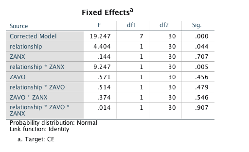

#### Article ID: NoMcC
#### Pilot: Alicia Hofelich Mohr
#### Copilot: Maya Mathur
#### Start date: Mar 31 2017
#### End date: Oct 08 2017  
#### Final verification: Tom Hardwicke
#### Date: Nov 12 2017

-------

#### Methods summary: 
Researchers investigated the extent to which participants automatically imitate a heterosexual romantic partner versus a close friend of the same gender, and whether this imitation varies with levels of attachment anxiety or avoidance in each relationship (as assessed by an attachment questionnaire). Partners and friends were recorded performing mouth-opening movements, which were then presented to the participants as they were also instructed to either perform congruent or incongruent mouth-opening actions. Latency to perform the movement was measured using electromyographic (EMG) recordings of the Obicularis Oris. 

The extent to which latency was affected by congruency of stimulus, type of partner (platonic versus romantic) and attachment style was tested. 

It appears that two participants were removed for having attachment scores over two SD of the group mean (IDs 5 and 7). These ids are missing from the dataset, so there is no way to confirm this statement. The raw EMG data is also missing and the lack of metadata requires some exploration of the data to determine which variables contain what information. 

------

#### Target outcomes: 

> First, scores reflecting attachment-related anxiety (ANX) and avoidance (AVO) were extracted for both the romantic and the platonic relationship, for each participant (following Fraley et al., 2000). Two participants were excluded for having scores >±2SD from the group mean, leaving 19 participants for final analysis. Mean ANX scores did not significantly differ between relationship types, M(romantic) = 1.75, 95% CI[1.14, 2.36], M(platonic) = 1.95 95% CI[1.41, 2.48], t(18) = 0.64, p > 0.250. However there was a significant difference in AVO scores, M(romantic) = 1.20, 95% CI[0.75, 1.65], M(platonic) = 3.11, 95% CI[2.33, 3.90], t(18) = 5.28, p < 0.001, d = 1.44. There were no gender differences in any of the attachment scores (all p-values > 0.11).

> To obtain a broad understanding of automatic imitation of partners and friends before attachment was considered, we first carried out a basic repeated-measures ANOVA with two within-subjects factors, Congruency (congruent vs. incongruent) and Relationship (platonic vs. romantic). This revealed an expected large main effect of Congruency, F(1, 18) = 91.8, p < 0.001, whereby participants were significantly faster to respond to congruent trials, M = 390 ms, 95% CI[333, 447], than incongruent trials, M = 465 ms, 95% CI[402, 529]. Importantly, this effect was significantly moderated by Relationship, F(1, 18) = 14.96, p = 0.001. Paired t-tests revealed that participants were faster to respond to their partner than their friend on congruent trials, MPARTNER = 378 ms, MFRIEND = 400 ms, t(18) = 2.70, p = 0.015, and slower to respond to their partner compared to their friend on incongruent trials, MPARTNER = 476 ms, MFRIEND = 454 ms, t(18) = 1.89, p = 0.075. The absolute difference in RT between trials featuring the partner and the friend did not significantly differ for congruent vs. incongruent conditions, MCONG = 34.3 ms, MINCONG = 38.1 ms, t(18) = 0.36, p = 0.725. This suggested that the effects of Relationship were observed relatively equally in both congruent and incongruent trials.

> Next, adult attachment scores were added to the analyses to investigate how these were related to automatic imitation. As each participant had four separate scores indicating their attachment to their partner and to their friend, a linear mixed effects model was deemed a suitable alternative to standard repeated-measures ANCOVA as it allows for covariates that differ for different levels of the repeated factor. The dependent variable was the congruency effect (CE), calculated by subtracting the mean RT for incongruent trials from those for congruent trials, for ‘partner’ and ‘friend’ separately. Using GENLINMIXED in SPSS 21, a fully-factorial model was fitted with one within-subjects categorical predictor, Relationship (platonic vs. romantic), and two standardised continuous between-subjects predictors, ANX and AVO. A random factor, representing the intercept for each participant, was also entered, to take into account the within-subjects nature of the data.

> This model was a significant fit for the data, F(7, 30) = 19.25, p < 0.001. Inspection of the model parameters revealed a main effect of Relationship, F(1, 30) = 4.40, p = 0.044, whereby individuals showed significantly greater mimicry of their partners than they did their friends, controlling for differences in ANX and AVO attachment style (see Fig. 2). This effect was significantly moderated by ANX, F(1, 30) = 9.25, p = 0.005, whereby ANX had a significantly different effect on mimicry of partners compared to friends.


------


```{r global_options, include=FALSE}
knitr::opts_chunk$set(echo=TRUE, warning=FALSE, message=FALSE)

# prepare an empty report object, we will update this each time we run compareValues2()
reportObject <- data.frame("Article_ID" = NA, "valuesChecked" = 0, "eyeballs" = 0, "Total_df" = 0, "Total_p" = 0, "Total_mean" = 0, "Total_sd" = 0, "Total_se" = 0, "Total_ci" = 0, "Total_bf" = 0, "Total_t" = 0, "Total_F" = 0, "Total_es" = 0, "Total_median" = 0, "Total_irr" = 0, "Total_r" = 0, "Total_z" = 0, "Total_coeff" = 0, "Total_n" = 0, "Total_x2" = 0, "Total_other" = 0, "Insufficient_Information_Errors" = 0, "Decision_Errors" = 0, "Major_Numerical_Errors" = 0, "Minor_Numerical_Errors" = 0, "Major_df" = 0, "Major_p" = 0, "Major_mean" = 0, "Major_sd" = 0, "Major_se" = 0, "Major_ci" = 0, "Major_bf" = 0, "Major_t" = 0, "Major_F" = 0, "Major_es" = 0, "Major_median" = 0, "Major_irr" = 0, "Major_r" = 0, "Major_z" = 0, "Major_coeff" = 0, "Major_n" = 0, "Major_x2" = 0, "Major_other" = 0, "affectsConclusion" = NA, "error_typo" = 0, "error_specification" = 0, "error_analysis" = 0, "error_data" = 0, "error_unidentified" = 0, "Author_Assistance" = NA, "resolved_typo" = 0, "resolved_specification" = 0, "resolved_analysis" = 0, "resolved_data" = 0, "correctionSuggested" = NA, "correctionPublished" = NA)
```

## Step 1: Load packages


```{r}
library(tidyverse) # for data munging
library(knitr) # for kable table formating
library(haven) # import and export 'SPSS', 'Stata' and 'SAS' Files
library(readxl) # import excel files
library(CODreports) # custom report functions
library(nlme) #for mixed linear model, most similar output to SPSS
library(lsr) # for cohens d
library(afex) # for anova

m_ci <- function(vector){ # a function to calculate cis of the mean
  df <- length(vector)-1 # degrees of freedom
  E = qt(.975, df)*se(vector) # moe
  xbar = mean(vector)  # sample mean 
  return(xbar + c(-E, E)) # lower and upper cis
}
```

## Step 2: Load data

```{r}
dataset1 = read_excel(path="data/data.xlsx", sheet = 1)
dataset2 = read_excel(path="data/data.xlsx", sheet = 2)
```

## Step 3: Tidy data

The lack of any usable metadata makes it very difficult to know what each column is, and what the values within columns represent. 

```{r, results='hide'}
head(dataset1)
```

Id1 and couple_ID have a 1:1 relationship, so unclear what the difference between those two variables is. 

Since each line with the same id1 value and different "VID_FACE" values have different attachment scores (AVO and ANX), this must be partner/friend rather than congruent/incongruent. Unclear which is 1 and which is 2.  

```{r}
by(dataset1$AVO, dataset1$VID_FACE, summary)
by(dataset1$ANX, dataset1$VID_FACE, summary)
```

Based on the means and description from the results, romantic partner must be 1 and friend 2. 

Cannot work out what Baseline_M is. 

## Step 4: Run analysis

### Preprocessing

Dataset2 needs to be reshaped in order to run the tests described. 

```{r}
#add ID variable (1-21, missing 5 and 7 - have to assume they are in the same order, since no IDs were included... )
dataset2$ID = c(1:4, 6, 8:21)
dataset2.long = gather(dataset2, key=type, value=mean_latency, M_CONG_P:M_INCONG_F)
dataset2.long$congruency = gsub("M_|_P|_F", "", dataset2.long$type)
dataset2.long$relationship = gsub("M_CONG_|M_INCONG_", "", dataset2.long$type)
```

In order to run the linear mixed model described, the two datasets need to be combined, and a new variable "congruency effect" needs to be created. 

```{r}
dataset2.long = subset(dataset2.long, select=c("ID", "relationship", "congruency", "mean_latency"))
dataset3 = spread(dataset2.long, congruency, mean_latency, convert=T, drop=T)

#create CE scores (incongruent - congruent latency)
dataset3$CE = dataset3$INCONG - dataset3$CONG

#merge AVO and ANX data into this dataset for analysis
#create new variable with P and F values for VID_FACE (1= Partner, 2= Friend)
dataset1$relationship = ifelse(dataset1$VID_FACE==1, "P", "F")

#Merge in the AVO and ANX scores into the data
dataset3 = merge(dataset3, subset(dataset1, select=c("id1", "relationship", "AVO", "ANX", "ZAVO", "ZANX", "ZANX_flipped", "ZAVO_flipped")), by.x=c("ID", "relationship"), by.y=c("id1", "relationship"))
```

### Descriptive statistics

> Two participants were excluded for having scores >±2SD from the group mean, leaving 19 participants for final analysis.

```{r}
levels(factor(dataset1$id1))
length(levels(factor(dataset1$id1)))
```

It appears that participants with IDs 5 and 7 are not included in the data, so it is assumed those participants were removed already. There are indeed 19 participants in the data.
 
> Mean ANX scores did not significantly differ between relationship types, M(romantic) = 1.75, 95% CI[1.14, 2.36], M(platonic) = 1.95 95% CI[1.41, 2.48], t(18) = 0.64, p > 0.250. 

```{r}
sumtab <- dataset1 %>%
  group_by(VID_FACE) %>%
  summarize(mean_ANX = mean(ANX), sd_ANX=sd(ANX), hci = (mean(ANX) + 2.10*(sd(ANX)/sqrt(19))), lci = (mean(ANX) - 2.10*(sd(ANX)/sqrt(19))))

m1 <- sumtab %>% filter(VID_FACE == 1) %>% pull(mean_ANX)
ci_l <- sumtab %>% filter(VID_FACE == 1) %>% pull(lci)
ci_h <- sumtab %>% filter(VID_FACE == 1) %>% pull(hci)

reportObject <- compareValues2(reportedValue = "1.75", obtainedValue = m1, valueType = 'mean')
reportObject <- compareValues2(reportedValue = "1.14", obtainedValue = ci_l, valueType = 'ci')
reportObject <- compareValues2(reportedValue = "2.36", obtainedValue = ci_h, valueType = 'ci')

m2 <- sumtab %>% filter(VID_FACE == 2) %>% pull(mean_ANX)
ci_l_2 <- sumtab %>% filter(VID_FACE == 2) %>% pull(lci)
ci_h_2 <- sumtab %>% filter(VID_FACE == 2) %>% pull(hci)

reportObject <- compareValues2(reportedValue = "1.95", obtainedValue = m2, valueType = 'mean')
reportObject <- compareValues2(reportedValue = "1.41", obtainedValue = ci_l_2, valueType = 'ci')
reportObject <- compareValues2(reportedValue = "2.48", obtainedValue = ci_h_2, valueType = 'ci')

t.out <- t.test(ANX ~ VID_FACE, data=dataset1, paired=T)
reportObject <- compareValues2(reportedValue = "18", obtainedValue = t.out$parameter, valueType = 'df')
reportObject <- compareValues2(reportedValue = "0.64", obtainedValue = -t.out$statistic, valueType = 't')
reportObject <- compareValues2(reportedValue = "eyeballMATCH", obtainedValue = t.out$p.value, valueType = 'p')
```

These values seem to match the reported results. 

> However there was a significant difference in AVO scores, M(romantic) = 1.20, 95% CI[0.75, 1.65], M(platonic) = 3.11, 95% CI[2.33, 3.90], t(18) = 5.28, p < 0.001, d = 1.44. 

```{r}
sumtab <- dataset1 %>%
  group_by(VID_FACE) %>%
  summarize(mean_AVO = mean(AVO), sd_AVO=sd(AVO), hci = (mean(AVO) + 2.10*(sd(AVO)/sqrt(19))), lci = (mean(AVO) - 2.10*(sd(AVO)/sqrt(19))))

m1 <- sumtab %>% filter(VID_FACE == 1) %>% pull(mean_AVO)
ci_l <- sumtab %>% filter(VID_FACE == 1) %>% pull(lci)
ci_h <- sumtab %>% filter(VID_FACE == 1) %>% pull(hci)

reportObject <- compareValues2(reportedValue = "1.20", obtainedValue = m1, valueType = 'mean')
reportObject <- compareValues2(reportedValue = "0.75", obtainedValue = ci_l, valueType = 'ci')
reportObject <- compareValues2(reportedValue = "1.65", obtainedValue = ci_h, valueType = 'ci')

m2 <- sumtab %>% filter(VID_FACE == 2) %>% pull(mean_AVO)
ci_l_2 <- sumtab %>% filter(VID_FACE == 2) %>% pull(lci)
ci_h_2 <- sumtab %>% filter(VID_FACE == 2) %>% pull(hci)

reportObject <- compareValues2(reportedValue = "3.11", obtainedValue = m2, valueType = 'mean')
reportObject <- compareValues2(reportedValue = "2.33", obtainedValue = ci_l_2, valueType = 'ci')
reportObject <- compareValues2(reportedValue = "3.90", obtainedValue = ci_h_2, valueType = 'ci')

t.out <- t.test(AVO ~ VID_FACE, data=dataset1, paired=T)

reportObject <- compareValues2(reportedValue = "18", obtainedValue = t.out$parameter, valueType = 'df')
reportObject <- compareValues2(reportedValue = "5.28", obtainedValue = -t.out$statistic, valueType = 't')
reportObject <- compareValues2(reportedValue = "eyeballMATCH", obtainedValue = t.out$p.value, valueType = 'p')
```

> There were no gender differences in any of the attachment scores (all p-values > 0.11).

Unclear what test they used - perhaps separate t-tests for each test/relationship since they said "all" p-values rather than "both"?
```{r}
p1 <- t.test(AVO ~ gender, data=subset(dataset1, dataset1$VID_FACE==1), paired=FALSE)$p.value
p2 <- t.test(AVO ~ gender, data=subset(dataset1, dataset1$VID_FACE==2), paired=FALSE)$p.value
p3 <- t.test(ANX ~ gender, data=subset(dataset1, dataset1$VID_FACE==1), paired=FALSE)$p.value
p4 <- t.test(ANX ~ gender, data=subset(dataset1, dataset1$VID_FACE==2), paired=FALSE)$p.value

reportObject <- compareValues2(reportedValue = "eyeballMATCH", obtainedValue = p1, valueType = 'p')
reportObject <- compareValues2(reportedValue = "eyeballMATCH", obtainedValue = p2, valueType = 'p')
reportObject <- compareValues2(reportedValue = "eyeballMATCH", obtainedValue = p3, valueType = 'p')
reportObject <- compareValues2(reportedValue = "eyeballMATCH", obtainedValue = p4, valueType = 'p')
```

Yes, the separate t-tests seem to match the results they report. 


### Inferential statistics

> To obtain a broad understanding of automatic imitation of partners and friends before attachment was considered, we first carried out a basic repeated-measures ANOVA with two within-subjects factors, Congruency (congruent vs. incongruent) and Relationship (platonic vs. romantic). This revealed an expected large main effect of Congruency, F(1, 18) = 91.8, p < 0.001, whereby participants were significantly faster to respond to congruent trials, M = 390 ms, 95% CI[333, 447], than incongruent trials, M = 465 ms, 95% CI[402, 529]. Importantly, this effect was significantly moderated by Relationship, F(1, 18) = 14.96, p = 0.001. 

Run the RM anova and calculate table:

```{r}
sumdat <- dataset2.long %>%
  group_by(congruency) %>%
  summarize(mean = mean(mean_latency), sd=sd(mean_latency), hci = (mean(mean_latency) + 2.10*(sd(mean_latency)/sqrt(19))), lci = (mean(mean_latency) - 2.10*(sd(mean_latency)/sqrt(19))))

# let's do the means and cis first
m1 <- sumdat %>% filter(congruency == "CONG") %>% pull(mean)
ci_l_1 <- sumdat %>% filter(congruency == "CONG") %>% pull(lci)
ci_h_1 <- sumdat %>% filter(congruency == "CONG") %>% pull(hci)

m2 <- sumdat %>% filter(congruency == "INCONG") %>% pull(mean)
ci_l_2 <- sumdat %>% filter(congruency == "INCONG") %>% pull(lci)
ci_h_2 <- sumdat %>% filter(congruency == "INCONG") %>% pull(hci)

reportObject <- compareValues2(reportedValue="390", obtainedValue = m1, valueType = 'mean')
reportObject <- compareValues2(reportedValue="333", obtainedValue = ci_l_1, valueType = 'ci')
reportObject <- compareValues2(reportedValue="447", obtainedValue = ci_h_1, valueType = 'ci')

reportObject <- compareValues2(reportedValue="465", obtainedValue = m2, valueType = 'mean')
reportObject <- compareValues2(reportedValue="402", obtainedValue = ci_l_2, valueType = 'ci')
reportObject <- compareValues2(reportedValue="529", obtainedValue = ci_h_2, valueType = 'ci')

# now the anova
aov.out <- aov_ez(data=dataset2.long, id = "ID", dv = "mean_latency", within = c("congruency", "relationship"), anova_table = list(correction = "none", es = "pes"), type = 'III')

# main effect congruency
reportObject <- compareValues2(reportedValue = "1", obtainedValue = aov.out$anova_table$`num Df`[1], valueType = 'df')
reportObject <- compareValues2(reportedValue = "18", obtainedValue = aov.out$anova_table$`den Df`[1], valueType = 'df')
reportObject <- compareValues2(reportedValue = "91.8", obtainedValue = aov.out$anova_table$`F`[1], valueType = 'F')
reportObject <- compareValues2(reportedValue = "eyeballMATCH", obtainedValue = aov.out$anova_table$`Pr(>F)`[1], valueType = 'p')

# interaction congruency*relationship
reportObject <- compareValues2(reportedValue = "1", obtainedValue = aov.out$anova_table$`num Df`[3], valueType = 'df')
reportObject <- compareValues2(reportedValue = "18", obtainedValue = aov.out$anova_table$`den Df`[3], valueType = 'df')
reportObject <- compareValues2(reportedValue = "14.96", obtainedValue = aov.out$anova_table$`F`[3], valueType = 'F')
reportObject <- compareValues2(reportedValue = "0.001", obtainedValue = aov.out$anova_table$`Pr(>F)`[3], valueType = 'p')
```

> Paired t-tests revealed that participants were faster to respond to their partner than their friend on congruent trials, MPARTNER = 378 ms, MFRIEND = 400 ms, t(18) = 2.70, p = 0.015, and slower to respond to their partner compared to their friend on incongruent trials, MPARTNER = 476 ms, MFRIEND = 454 ms, t(18) = 1.89, p = 0.075. 

Calculating means and running t-tests. 

```{r}
sumdat <- dataset2.long %>%
        group_by(congruency, relationship) %>%
        summarize(mean=mean(mean_latency))

m1 <- sumdat %>% filter(congruency == "CONG", relationship == 'F') %>% pull(mean)
m2 <- sumdat %>% filter(congruency == "CONG", relationship == 'P') %>% pull(mean)
m3 <- sumdat %>% filter(congruency == "INCONG", relationship == 'F') %>% pull(mean)
m4 <- sumdat %>% filter(congruency == "INCONG", relationship == 'P') %>% pull(mean)

reportObject <- compareValues2(reportedValue = "378", obtainedValue = m2, valueType = 'mean')
reportObject <- compareValues2(reportedValue = "400", obtainedValue = m1, valueType = 'mean')
reportObject <- compareValues2(reportedValue = "476", obtainedValue = m4, valueType = 'mean')
reportObject <- compareValues2(reportedValue = "454", obtainedValue = m3, valueType = 'mean')

t.out1 <- t.test(mean_latency ~ relationship, data=subset(dataset2.long, dataset2.long$congruency=="CONG"), paired=T)
t.out2 <- t.test(mean_latency ~ relationship, data=subset(dataset2.long, dataset2.long$congruency=="INCONG"), paired=T)

reportObject <- compareValues2(reportedValue = "18", obtainedValue = t.out1$parameter, valueType = 'df')
reportObject <- compareValues2(reportedValue = "2.70", obtainedValue = t.out1$statistic, valueType = 't')
reportObject <- compareValues2(reportedValue = "0.015", obtainedValue = t.out1$p.value, valueType = 'p')

reportObject <- compareValues2(reportedValue = "18", obtainedValue = t.out2$parameter, valueType = 'df')
reportObject <- compareValues2(reportedValue = "1.89", obtainedValue = -t.out2$statistic, valueType = 't')
reportObject <- compareValues2(reportedValue = "0.075", obtainedValue = t.out2$p.value, valueType = 'p')
```

> The absolute difference in RT between trials featuring the partner and the friend did not significantly differ for congruent vs. incongruent conditions, MCONG = 34.3 ms, MINCONG = 38.1 ms, t(18) = 0.36, p = 0.725. This suggested that the effects of Relationship were observed relatively equally in both congruent and incongruent trials.

Re-calculate the difference scores:
```{r}
dataset2$abspfdiff_cong = abs(dataset2$M_CONG_P - dataset2$M_CONG_F)
dataset2$abspfdiff_incong = abs(dataset2$M_INCONG_P - dataset2$M_INCONG_F)
```

Compare using a t-test
```{r}
t.out <- t.test(dataset2$abspfdiff_cong, dataset2$abspfdiff_incong, var.equal = T, paired = T)
reportObject <- compareValues2(reportedValue = "34.3", obtainedValue = mean(dataset2$abspfdiff_cong), valueType = 'mean')
reportObject <- compareValues2(reportedValue = "38.1", obtainedValue = mean(dataset2$abspfdiff_incong), valueType = 'mean')
reportObject <- compareValues2(reportedValue = "18", obtainedValue = t.out$parameter, valueType = 'df')
reportObject <- compareValues2(reportedValue = "0.36", obtainedValue = -t.out$statistic, valueType = 't')
reportObject <- compareValues2(reportedValue = "0.725", obtainedValue = t.out$p.value, valueType = 'p')
```
Values match reported results. 

> Next, adult attachment scores were added to the analyses to investigate how these were related to automatic imitation. As each participant had four separate scores indicating their attachment to their partner and to their friend, a linear mixed effects model was deemed a suitable alternative to standard repeated-measures ANCOVA as it allows for covariates that differ for different levels of the repeated factor. The dependent variable was the congruency effect (CE), calculated by subtracting the mean RT for incongruent trials from those for congruent trials, for ‘partner’ and ‘friend’ separately. Using GENLINMIXED in SPSS 21, a fully-factorial model was fitted with one within-subjects categorical predictor, Relationship (platonic vs. romantic), and two standardised continuous between-subjects predictors, ANX and AVO. A random factor, representing the intercept for each participant, was also entered, to take into account the within-subjects nature of the data.

Needed to reshape and merge the data (above in Preprocessing) in order to get it into the right shape for this analysis. 

> This model was a significant fit for the data, F(7, 30) = 19.25, p < 0.001. Inspection of the model parameters revealed a main effect of Relationship, F(1, 30) = 4.40, p = 0.044, whereby individuals showed significantly greater mimicry of their partners than they did their friends, controlling for differences in ANX and AVO attachment style (see Fig. 2).
> This effect was significantly moderated by ANX, F(1, 30) = 9.25, p = 0.005, whereby ANX had a significantly different effect on mimicry of partners compared to friends. For the partner, the parameter estimate of the effect of ANX on mimicry was positive, M = 19 ms, 95% CI[−1, 40], p = 0.064, and for the friend was negative, M = −15 ms, 95% CI[−26, −4], p = 0.012. In contrast, there was no significant main effect of AVO attachment style, F(1, 30) = 0.57, p = 0.456, nor did it interact with Relationship, F(1, 30) = 0.51, p = 0.479. These findings are summarised in Fig. 3.


Run linear mixed effects model. Because stats programs vary in how they calculate these models, I will first try it in R to see if the general patterns of significance are similar, and then re-run in SPSS using the GENLINMIXED procedure they describe. 

```{r}
#to get the overall fit p value:
basemodel = lme(CE ~ 1, random = ~1|ID/relationship, data=dataset3, method="ML")
mle1 = lme(CE ~ relationship*ZANX*ZAVO, random= ~1|ID/relationship, data=dataset3, method="ML")
anova(basemodel, mle1)
```

While the overall model "fit" is not reported in the lme output, an approximation can be calculated using a model based on means. The comparison between this "baseline" model and the full model is similar to the reported finding that the model fit well (specific values are different, but will not report as error because of the differences in programs).


```{r}
#Parameter estimates
anova(mle1, type="marginal") #use Type III SS for comparison to SPSS
summary(mle1)
```

Because of the differences in programs used, it is very likely that  differences seen here are due to the different ways each program calculates the model. 

However, there are some notable inconsistencies: 

* The reported denominator df are not the same as I see (30 reported versus 12 observed here).
* The main effect of relationship was right at significance, rather than highly significant 
* The interaction between relationship and ZANX was not significant 
* Parameter estimates and t-values did not match up for the interaction 

In order to determine whether I get the same result in SPSS using the procedure described, I wrote out the data file I used to run the mixed model and read it into SPSS. 

```{r, run=FALSE}
write.csv(dataset3, file="spss/TestforSPSS.csv", row.names = FALSE)
```

The following SPSS syntax was used to read in the .csv and run a GENLINMIXED model as described in the results. 

## UPDATE FROM AUTHOR

The original syntax was requested from the author in order to replicate the mixed models analysis. The authors also used the data from dataset1 to do this analysis. Because there were insufficient variable and value labels attached to the data, I did not know which columns corresponded to the variables described in the analysis, so had created a modified version of dataset2 for this analysis. 

The two files, however, were identical. I confimed this by first sorting the data in the same way, and then recoding the relationship variable into a numeric format to match the VID_FACE variable in dataset1. 

```{r}
dataset3 <- arrange(dataset3, ID, relationship)
dataset1 <- arrange(dataset1, id1, desc(VID_FACE))

#recode F and P as 2 and 1
dataset3$relationshipnum <- ifelse(dataset3$relationship=="P", 1, 2)

```

Check matches for each variable in model
```{r}
all_equal(dataset1$id1, dataset3$ID)
all_equal(dataset1$VID_FACE, dataset3$relationshipnum)
all_equal(dataset1$BASELINE_M, dataset3$CE) #maybe due to rounding errors?
all_equal(round(dataset1$BASELINE_M, 6), round(dataset3$CE, 6))
all_equal(dataset1$ZANX, dataset3$ZANX)
all_equal(dataset1$ZAVO, dataset3$ZAVO)

```

The only difference between the two datasets are in how the numeric values are stored for the congruent/incongruent difference. Rounding to 6 decimal points provides a TRUE result that they are identifical. However, the large stored decimal point in the CE variables produced an error when parsing the columns in the .csv file when read into SPSS initially. Therefore, the "TestforSPSS.csv" above was first converted to Excel .xlsx by opening in excel and saving as before it was read into SPSS. 

The following syntax was used in SPSS (Version 24, Mac OS). The main differences between this and what I attempted in previous versions is that the authors used an identity covariance structure, while I used the default diagonal covariance structure, which changed how the model was estimated.   


```{r}
# GET DATA
#   /TYPE=XLSX
#   /FILE='/Users/hofelich/Documents/DataAnalysis/Cognition '+
#     'Reproducibility/set_NoMcC/spss/TestforSPSS.xlsx'
#   /SHEET=name 'TestforSPSS'
#   /CELLRANGE=FULL
#   /READNAMES=ON
#   /DATATYPEMIN PERCENTAGE=95.0
#   /HIDDEN IGNORE=YES.
# EXECUTE.

# DATASET NAME DataSet1 WINDOW=FRONT.
# 
# GENLINMIXED
#   /DATA_STRUCTURE SUBJECTS=ID REPEATED_MEASURES=relationship COVARIANCE_TYPE=IDENTITY
#   /FIELDS TARGET=CE TRIALS=NONE OFFSET=NONE
#   /TARGET_OPTIONS DISTRIBUTION=NORMAL LINK=IDENTITY
#   /FIXED  EFFECTS=relationship ZANX relationship*ZANX ZAVO relationship*ZAVO ZAVO*ZANX relationship*ZAVO*ZANX 
#     USE_INTERCEPT=TRUE
#   /RANDOM USE_INTERCEPT=TRUE SUBJECTS=ID COVARIANCE_TYPE=VARIANCE_COMPONENTS 
#   /BUILD_OPTIONS TARGET_CATEGORY_ORDER=ASCENDING INPUTS_CATEGORY_ORDER=ASCENDING MAX_ITERATIONS=100 
#     CONFIDENCE_LEVEL=95 DF_METHOD=RESIDUAL COVB=ROBUST
#   /EMMEANS TABLES=relationship COMPARE=relationship CONTRAST=SIMPLE 
#   /EMMEANS_OPTIONS SCALE=ORIGINAL PADJUST=LSD.

```

The output was as follows: 

Fixed effects:


> This model was a significant fit for the data, F(7, 30) = 19.25, p < 0.001. Inspection of the model parameters revealed a main effect of Relationship, F(1, 30) = 4.40, p = 0.044, whereby individuals showed significantly greater mimicry of their partners than they did their friends, controlling for differences in ANX and AVO attachment style (see Fig. 2). This effect was significantly moderated by ANX, F(1, 30) = 9.25, p = 0.005, whereby ANX had a significantly different effect on mimicry of partners compared to friends.

These values both seem to match the reported values perfectly. Check explictly:

```{r}
reportObject <- compareValues2(reportedValue = '7', obtainedValue = 7, valueType = 'df')
reportObject <- compareValues2(reportedValue = '30', obtainedValue = 30, valueType = 'df')
reportObject <- compareValues2(reportedValue = '19.25', obtainedValue = 19.247, valueType = 'F')
reportObject <- compareValues2(reportedValue = 'eyeballMATCH', obtainedValue = 0.001, valueType = 'p')

reportObject <- compareValues2(reportedValue = '1', obtainedValue = 1, valueType = 'df')
reportObject <- compareValues2(reportedValue = '30', obtainedValue = 30, valueType = 'df')
reportObject <- compareValues2(reportedValue = '4.40', obtainedValue = 4.404, valueType = 'F')
reportObject <- compareValues2(reportedValue = '0.044', obtainedValue = 0.044, valueType = 'p')

reportObject <- compareValues2(reportedValue = '1', obtainedValue = 1, valueType = 'df')
reportObject <- compareValues2(reportedValue = '30', obtainedValue = 30, valueType = 'df')
reportObject <- compareValues2(reportedValue = '9.25', obtainedValue = 9.247, valueType = 'F')
reportObject <- compareValues2(reportedValue = '0.005', obtainedValue = 0.005, valueType = 'p')
```

## Step 5: Conclusion

Despite having very little descriptive metadata along with the datasets, all of the results were able to be reproduced with only minor rounding variation. 

With the updated syntax from the author, I also replicated the mixed linear model analysis and the preprocessing of dataset2 they did to run it. 

```{r}
reportObject$Article_ID <- "NoMcC"
reportObject$affectsConclusion <- NA
reportObject$error_typo <- 0
reportObject$error_specification <- 0
reportObject$error_analysis <- 0
reportObject$error_data <- 0
reportObject$error_unidentified <- 0
reportObject$Author_Assistance <- T
reportObject$resolved_typo <- 0
reportObject$resolved_specification <- 1
reportObject$resolved_analysis <- 0
reportObject$resolved_data <- 1
reportObject$correctionSuggested <- "no"
reportObject$correctionPublished <- NA

# decide on final outcome
if(reportObject$Decision_Errors > 0 | reportObject$Major_Numerical_Errors > 0 | reportObject$Insufficient_Information_Errors > 0){
  reportObject$finalOutcome <- "Failure"
  if(reportObject$Author_Assistance == T){
    reportObject$finalOutcome <- "Failure despite author assistance"
  }
}else{
  reportObject$finalOutcome <- "Success"
  if(reportObject$Author_Assistance == T){
    reportObject$finalOutcome <- "Success with author assistance"
  }
}

# save the report object
filename <- paste0("reportObject_", reportObject$Article_ID,".csv")
write_csv(reportObject, filename)
```

## Report Object

```{r, echo = FALSE}
# display report object in chunks
kable(reportObject[2:10], align = 'l')
kable(reportObject[11:20], align = 'l')
kable(reportObject[21:25], align = 'l')
kable(reportObject[26:30], align = 'l')
kable(reportObject[31:35], align = 'l')
kable(reportObject[36:40], align = 'l')
kable(reportObject[41:45], align = 'l')
kable(reportObject[46:51], align = 'l')
kable(reportObject[52:57], align = 'l')
```

## Session information

```{r session_info, include=TRUE, echo=TRUE, results='markup'}
devtools::session_info()
```
