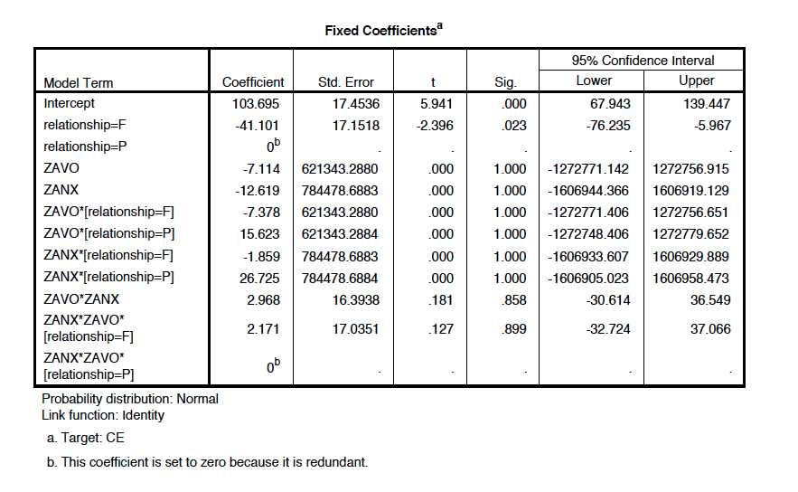

#### Article ID: NoMcC
#### Pilot: Alicia Hofelich Mohr
#### Co-pilot: Tom Hardwicke  
#### Start date: 03-31-2017
#### End date: 04-05-2017   

-------

#### Methods summary: 
Researchers investigated the extent to which participants automatically imitate a heterosexual romantic partner versus a close friend of the same gender, and whether this imitation varies with levels of attachment anxiety or avoidance in each relationship (as assessed by an attachment questionnaire). Partners and friends were recorded performing mouth-opening movements, which were then presented to the participants as they were also instructed to either perform congruent or incongruent mouth-opening actions. Latency to perform the movement was measured using electromyographic (EMG) recordings of the Obicularis Oris. 

The extent to which latency was affected by congruency of stimulus, type of partner (platonic versus romantic) and attachment style was tested. 

It appears that two participants were removed for having attachment scores over two SD of the group mean (IDs 5 and 7). These ids are missing from the dataset, so there is no way to confirm this statement. The raw EMG data is also missing and the lack of metadata requires some exploration of the data to determine which variables contain what information. 

------

#### Target outcomes: 

> First, scores reflecting attachment-related anxiety (ANX) and avoidance (AVO) were extracted for both the romantic and the platonic relationship, for each participant (following Fraley et al., 2000). Two participants were excluded for having scores >±2SD from the group mean, leaving 19 participants for final analysis. Mean ANX scores did not significantly differ between relationship types, M(romantic) = 1.75, 95% CI[1.14, 2.36], M(platonic) = 1.95 95% CI[1.41, 2.48], t(18) = 0.64, p > 0.250. However there was a significant difference in AVO scores, M(romantic) = 1.20, 95% CI[0.75, 1.65], M(platonic) = 3.11, 95% CI[2.33, 3.90], t(18) = 5.28, p < 0.001, d = 1.44. There were no gender differences in any of the attachment scores (all p-values > 0.11).

> To obtain a broad understanding of automatic imitation of partners and friends before attachment was considered, we first carried out a basic repeated-measures ANOVA with two within-subjects factors, Congruency (congruent vs. incongruent) and Relationship (platonic vs. romantic). This revealed an expected large main effect of Congruency, F(1, 18) = 91.8, p < 0.001, whereby participants were significantly faster to respond to congruent trials, M = 390 ms, 95% CI[333, 447], than incongruent trials, M = 465 ms, 95% CI[402, 529]. Importantly, this effect was significantly moderated by Relationship, F(1, 18) = 14.96, p = 0.001. Paired t-tests revealed that participants were faster to respond to their partner than their friend on congruent trials, MPARTNER = 378 ms, MFRIEND = 400 ms, t(18) = 2.70, p = 0.015, and slower to respond to their partner compared to their friend on incongruent trials, MPARTNER = 476 ms, MFRIEND = 454 ms, t(18) = 1.89, p = 0.075. The absolute difference in RT between trials featuring the partner and the friend did not significantly differ for congruent vs. incongruent conditions, MCONG = 34.3 ms, MINCONG = 38.1 ms, t(18) = 0.36, p = 0.725. This suggested that the effects of Relationship were observed relatively equally in both congruent and incongruent trials.

> Next, adult attachment scores were added to the analyses to investigate how these were related to automatic imitation. As each participant had four separate scores indicating their attachment to their partner and to their friend, a linear mixed effects model was deemed a suitable alternative to standard repeated-measures ANCOVA as it allows for covariates that differ for different levels of the repeated factor. The dependent variable was the congruency effect (CE), calculated by subtracting the mean RT for incongruent trials from those for congruent trials, for ‘partner’ and ‘friend’ separately. Using GENLINMIXED in SPSS 21, a fully-factorial model was fitted with one within-subjects categorical predictor, Relationship (platonic vs. romantic), and two standardised continuous between-subjects predictors, ANX and AVO. A random factor, representing the intercept for each participant, was also entered, to take into account the within-subjects nature of the data.

> This model was a significant fit for the data, F(7, 30) = 19.25, p < 0.001. Inspection of the model parameters revealed a main effect of Relationship, F(1, 30) = 4.40, p = 0.044, whereby individuals showed significantly greater mimicry of their partners than they did their friends, controlling for differences in ANX and AVO attachment style (see Fig. 2).

> This effect was significantly moderated by ANX, F(1, 30) = 9.25, p = 0.005, whereby ANX had a significantly different effect on mimicry of partners compared to friends. For the partner, the parameter estimate of the effect of ANX on mimicry was positive, M = 19 ms, 95% CI[−1, 40], p = 0.064, and for the friend was negative, M = −15 ms, 95% CI[−26, −4], p = 0.012. In contrast, there was no significant main effect of AVO attachment style, F(1, 30) = 0.57, p = 0.456, nor did it interact with Relationship, F(1, 30) = 0.51, p = 0.479. These findings are summarised in Fig. 3.


------


```{r global_options, include=FALSE}
knitr::opts_chunk$set(echo=TRUE, warning=FALSE, message=FALSE)
```

## Step 1: Load packages


```{r}
library(tidyverse) # for data munging
library(knitr) # for kable table formating
library(haven) # import and export 'SPSS', 'Stata' and 'SAS' Files
library(readxl) # import excel files
library(devtools)
install_github("CODreports", repo="CognitionOpenDataProject/CODreports")
library(CODreports) # custom report functions
library(nlme) #for mixed linear model, most similar output to SPSS
```

## Step 2: Load data

```{r}
dataset1 = read_excel(path="data/data.xlsx", sheet = 1)
dataset2 = read_excel(path="data/data.xlsx", sheet = 2)
```

## Step 3: Tidy data

The lack of any usable metadata makes it very difficult to know what each column is, and what the values within columns represent. 
```{r, results='hide'}
head(dataset1)
summary(dataset1)
```


Id1 and couple_ID have a 1:1 relationship, so unclear what the difference between those two variables is. 
```{r}
table(dataset1$id1, dataset1$couple_ID)
```


Since each line with the same id1 value and different "VID_FACE" values have different attachment scores (AVO and ANX), this must be partner/friend rather than congruent/incongruent. Unclear which is 1 and which is 2.  
```{r}
by(dataset1$AVO, dataset1$VID_FACE, summary)
by(dataset1$ANX, dataset1$VID_FACE, summary)
```
Based on the means and description from the results, romantic partner must be 1 and friend 2. 

No idea what Baseline_M is. 


## Step 4: Run analysis

### Preprocessing

Dataset2 needs to be reshaped in order to run the tests described. 
```{r}
#add ID variable (1-21, missing 5 and 7 - have to assume they are in the same order, since no IDs were included... )
dataset2$ID = c(1:4, 6, 8:21)
dataset2.long = gather(dataset2, key=type, value=mean_latency, M_CONG_P:M_INCONG_F)
dataset2.long$congruency = gsub("M_|_P|_F", "", dataset2.long$type)
dataset2.long$relationship = gsub("M_CONG_|M_INCONG_", "", dataset2.long$type)
```


In order to run the linear mixed model described, the two datasets need to be combined, and a new variable "congruency effect" needs to be created. 
```{r}

dataset2.long = subset(dataset2.long, select=c("ID", "relationship", "congruency", "mean_latency"))
dataset3 = spread(dataset2.long, congruency, mean_latency, convert=T, drop=T)

#create CE scores (incongruent - congruent latency)
dataset3$CE = dataset3$INCONG - dataset3$CONG

#merge AVO and ANX data into this dataset for analysis
#create new variable with P and F values for VID_FACE (1= Partner, 2= Friend)
dataset1$relationship = ifelse(dataset1$VID_FACE==1, "P", "F")

#Merge in the AVO and ANX scores into the data
dataset3 = merge(dataset3, subset(dataset1, select=c("id1", "relationship", "AVO", "ANX", "ZAVO", "ZANX", "ZANX_flipped", "ZAVO_flipped")), by.x=c("ID", "relationship"), by.y=c("id1", "relationship"))

```


### Descriptive statistics

> Two participants were excluded for having scores >±2SD from the group mean, leaving 19 participants for final analysis.

```{r}
levels(factor(dataset1$id1))
length(levels(factor(dataset1$id1)))
```
 It appears that participants with IDs 5 and 7 are not included in the data, so it is assumed those participants were removed. There are indeed 19 participants in the data.
 
 
> Mean ANX scores did not significantly differ between relationship types, M(romantic) = 1.75, 95% CI[1.14, 2.36], M(platonic) = 1.95 95% CI[1.41, 2.48], t(18) = 0.64, p > 0.250. 

```{r}
kable(dataset1 %>%
  group_by(VID_FACE) %>%
  summarize(mean_ANX = mean(ANX), sd_ANX=sd(ANX), hci = (mean(ANX) + 2.10*(sd(ANX)/sqrt(19))), lci = (mean(ANX) - 2.10*(sd(ANX)/sqrt(19)))), digits=2, col.names = c("Relationship", "Mean", "SD", "High 95 CI", "Low 95 CI"), caption="ANX tests")

t.test(ANX ~ VID_FACE, data=dataset1, paired=T)
```
These values seem to match reported results. 


> However there was a significant difference in AVO scores, M(romantic) = 1.20, 95% CI[0.75, 1.65], M(platonic) = 3.11, 95% CI[2.33, 3.90], t(18) = 5.28, p < 0.001, d = 1.44. 

```{r}
kable(dataset1 %>%
  group_by(VID_FACE) %>%
  summarize(mean_AVO = mean(AVO), sd_AVO=sd(AVO), hci = (mean(AVO) + 2.10*(sd(AVO)/sqrt(19))), lci = (mean(AVO) - 2.10*(sd(AVO)/sqrt(19)))), digits=2, col.names = c("Relationship", "Mean", "SD", "High 95 CI", "Low 95 CI"), caption="AVO tests")

t.test(AVO ~ VID_FACE, data=dataset1, paired=T)
```
Matches reported results, minor rounding error in t-value. 
```{r}
compareValues(reportedValue = 5.28, obtainedValue = 5.2875)
```

> There were no gender differences in any of the attachment scores (all p-values > 0.11).

Unclear what test they used - perhaps separate t-tests for each test/relationship since they said "all" p-values rather than "both"?
```{r}
t.test(AVO ~ gender, data=subset(dataset1, dataset1$VID_FACE==1), paired=FALSE)
t.test(AVO ~ gender, data=subset(dataset1, dataset1$VID_FACE==2), paired=FALSE)
t.test(ANX ~ gender, data=subset(dataset1, dataset1$VID_FACE==1), paired=FALSE)
t.test(ANX ~ gender, data=subset(dataset1, dataset1$VID_FACE==2), paired=FALSE)
```

Yes, the separate t-tests seem to match the results they report. 


### Inferential statistics

> To obtain a broad understanding of automatic imitation of partners and friends before attachment was considered, we first carried out a basic repeated-measures ANOVA with two within-subjects factors, Congruency (congruent vs. incongruent) and Relationship (platonic vs. romantic). This revealed an expected large main effect of Congruency, F(1, 18) = 91.8, p < 0.001, whereby participants were significantly faster to respond to congruent trials, M = 390 ms, 95% CI[333, 447], than incongruent trials, M = 465 ms, 95% CI[402, 529]. Importantly, this effect was significantly moderated by Relationship, F(1, 18) = 14.96, p = 0.001. 

Run the RM anova and calculate table:
```{r}
summary(aov(mean_latency ~ congruency*relationship + Error(factor(ID)/(congruency*relationship)), data=dataset2.long))
kable(dataset2.long %>%
  group_by(congruency) %>%
  summarize(mean = mean(mean_latency), sd=sd(mean_latency), hci = (mean(mean_latency) + 2.10*(sd(mean_latency)/sqrt(19))), lci = (mean(mean_latency) - 2.10*(sd(mean_latency)/sqrt(19)))),digits=2, col.names = c("Congruency", "Mean", "SD", "High 95 CI", "Low 95 CI"))
```


Slight rounding errors in incongruent latency CIs

```{r}
compareValues(reportedValue=529, obtainedValue = 529.5436)
compareValues(reportedValue=402, obtainedValue = 401.4274)
```

> Paired t-tests revealed that participants were faster to respond to their partner than their friend on congruent trials, MPARTNER = 378 ms, MFRIEND = 400 ms, t(18) = 2.70, p = 0.015, and slower to respond to their partner compared to their friend on incongruent trials, MPARTNER = 476 ms, MFRIEND = 454 ms, t(18) = 1.89, p = 0.075. 

Calculating means and running t-tests. 
```{r}
kable(dataset2.long %>%
        group_by(congruency, relationship) %>%
        summarize(mean=mean(mean_latency)))
t.test(mean_latency ~ relationship, data=subset(dataset2.long, dataset2.long$congruency=="CONG"), paired=T)
t.test(mean_latency ~ relationship, data=subset(dataset2.long, dataset2.long$congruency=="INCONG"), paired=T)


```
Again, minor rounding errors in the reported values, but test results replicate. 
```{r}
compareValues(reportedValue = 378, obtainedValue = 378.8574)
compareValues(reportedValue = 400, obtainedValue = 400.5937)
compareValues(reportedValue = 454, obtainedValue = 454.4963)

```


> The absolute difference in RT between trials featuring the partner and the friend did not significantly differ for congruent vs. incongruent conditions, MCONG = 34.3 ms, MINCONG = 38.1 ms, t(18) = 0.36, p = 0.725. This suggested that the effects of Relationship were observed relatively equally in both congruent and incongruent trials.

Re-calculate the difference scores:
```{r}
dataset2$abspfdiff_cong = abs(dataset2$M_CONG_P - dataset2$M_CONG_F)
dataset2$abspfdiff_incong = abs(dataset2$M_INCONG_P - dataset2$M_INCONG_F)
```

Compare using a t-test
```{r}
t.test(dataset2$abspfdiff_cong, dataset2$abspfdiff_incong, var.equal = T, paired = T)
mean(dataset2$abspfdiff_cong)
mean(dataset2$abspfdiff_incong)
```
Values match reported results. 

> Next, adult attachment scores were added to the analyses to investigate how these were related to automatic imitation. As each participant had four separate scores indicating their attachment to their partner and to their friend, a linear mixed effects model was deemed a suitable alternative to standard repeated-measures ANCOVA as it allows for covariates that differ for different levels of the repeated factor. The dependent variable was the congruency effect (CE), calculated by subtracting the mean RT for incongruent trials from those for congruent trials, for ‘partner’ and ‘friend’ separately. Using GENLINMIXED in SPSS 21, a fully-factorial model was fitted with one within-subjects categorical predictor, Relationship (platonic vs. romantic), and two standardised continuous between-subjects predictors, ANX and AVO. A random factor, representing the intercept for each participant, was also entered, to take into account the within-subjects nature of the data.

Needed to reshape and merge the data (above in Preprocessing) in order to get it into the right shape for this analysis. 

> This model was a significant fit for the data, F(7, 30) = 19.25, p < 0.001. Inspection of the model parameters revealed a main effect of Relationship, F(1, 30) = 4.40, p = 0.044, whereby individuals showed significantly greater mimicry of their partners than they did their friends, controlling for differences in ANX and AVO attachment style (see Fig. 2).
> This effect was significantly moderated by ANX, F(1, 30) = 9.25, p = 0.005, whereby ANX had a significantly different effect on mimicry of partners compared to friends. For the partner, the parameter estimate of the effect of ANX on mimicry was positive, M = 19 ms, 95% CI[−1, 40], p = 0.064, and for the friend was negative, M = −15 ms, 95% CI[−26, −4], p = 0.012. In contrast, there was no significant main effect of AVO attachment style, F(1, 30) = 0.57, p = 0.456, nor did it interact with Relationship, F(1, 30) = 0.51, p = 0.479. These findings are summarised in Fig. 3.


Run linear mixed effects model. Because stats programs vary in how they calculate these models, I will first try it in R to see if the general patterns of significance are similar, and then re-run in SPSS using the GENLINMIXED procedure they describe. 
```{r}
#to get the overall fit p value:
basemodel = lme(CE ~ 1, random = ~1|ID/relationship, data=dataset3, method="ML")
mle1 = lme(CE ~ relationship*ZANX*ZAVO, random= ~1|ID/relationship, data=dataset3, method="ML")
anova(basemodel, mle1)
```
While the overall model "fit" is not reported in the lme output, an approximation can be calculated using a model based on means. The comparison between this "baseline" model and the full model is similar to the reported finding that the model fit well (specific values are different, but will not report as error because of the differences in programs).


```{r}
#Parameter estimates
anova(mle1, type="marginal") #use Type III SS for comparison to SPSS
summary(mle1)

```

Because of the differences in programs used, it is very likely that  differences seen here are due to the different ways each program calculates the model. 

However, there are some notable inconsistencies: 

* The reported denominator df are not the same as I see (30 reported versus 12 observed here).
* The main effect of relationship was right at significance, rather than highly significant 
* The interaction between relationship and ZANX was not significant 
* Parameter estimates and t-values did not match up for the interaction 

In order to determine whether I get the same result in SPSS using the procedure described, I wrote out the data file I used to run the mixed model and read it into SPSS. 
```{r, run=FALSE}
write.csv(dataset3, file="spss/TestforSPSS.csv", row.names = FALSE)
```

The following SPSS syntax was used to read in the .csv and run a GENLINMIXED model as described in the results. 

```{r}
# * Read in data file. 
# GET DATA  /TYPE=TXT
#   /FILE="spss/TestforSPSS.csv"
#   /DELCASE=LINE
#   /DELIMITERS=","
#   /QUALIFIER='"'
#   /ARRANGEMENT=DELIMITED
#   /FIRSTCASE=2
#   /IMPORTCASE=ALL
#   /VARIABLES=
#   ID F2.0
#   relationship A1
#   CONG F6.2
#   INCONG F6.2
#   CE F16.14
#   AVO.x F4.2
#   ANX.x F4.2
#   AVO.y F4.2
#   ANX.y F4.2
#   ZAVO F8.5
#   ZANX F8.5.
# CACHE.
# EXECUTE.
# DATASET NAME DataSet1 WINDOW=FRONT.
# 
# 
# DATASET ACTIVATE DataSet1.
# * Run GENLINMIXED as described in paper. 
# *Generalized Linear Mixed Models.
# GENLINMIXED
#   /DATA_STRUCTURE SUBJECTS=ID REPEATED_MEASURES=relationship COVARIANCE_TYPE=DIAGONAL
#   /FIELDS TARGET=CE TRIALS=NONE OFFSET=NONE
#   /TARGET_OPTIONS DISTRIBUTION=NORMAL LINK=IDENTITY
#   /FIXED  EFFECTS= relationship ZAVO ZANX relationship*ZAVO relationship*ZANX ZAVO*ZANX  relationship*ZANX*ZAVO
#     USE_INTERCEPT=TRUE
#   /RANDOM  USE_INTERCEPT=TRUE SUBJECTS=ID COVARIANCE_TYPE=VARIANCE_COMPONENTS 
#   /BUILD_OPTIONS TARGET_CATEGORY_ORDER=ASCENDING INPUTS_CATEGORY_ORDER=ASCENDING MAX_ITERATIONS=100 
#     CONFIDENCE_LEVEL=95 DF_METHOD=RESIDUAL COVB=MODEL PCONVERGE=0.000001(ABSOLUTE) SCORING=0 
#     SINGULAR=0.000000000001
#   /EMMEANS_OPTIONS SCALE=ORIGINAL PADJUST=LSD.
```

The Output was as follows:

Fixed effects:


Fixed coefficient estimates: 


One noticeable difference between this model and the results reported in the paper is that the denominator degrees of freedom do not match - they report an overall F of (7,30) while the data I have produces an F of (7, 28). Because I had to reshape and merge these datasets, it is possible they ran this test on a third dataset that wasn't shared, or perhaps included one of the two excluded participants. Hard to tell without more information. 

> This model was a significant fit for the data, F(7, 30) = 19.25, p < 0.001. 

In SPSS, we also see a significant fit for the corrected model, but the tests don't quite match F(7,28) = 4.236, p = .003. Hard to compare p values because they report < .001, so look at F values. 
```{r}
#compareValues(reportedValue = 19.25, obtainedValue = 4.236)
```


> Inspection of the model parameters revealed a main effect of Relationship, F(1, 30) = 4.40, p = 0.044, whereby individuals showed significantly greater mimicry of their partners than they did their friends, controlling for differences in ANX and AVO attachment style (see Fig. 2).

This was also found in my re-test, and this effect was more significant than they reported, F(1,28) = 5.742, p = .023.
```{r}
#compareValues(reportedValue = .044, obtainedValue = .023, isP=T)
```

> This effect was significantly moderated by ANX, F(1, 30) = 9.25, p = 0.005, whereby ANX had a significantly different effect on mimicry of partners compared to friends. For the partner, the parameter estimate of the effect of ANX on mimicry was positive, M = 19 ms, 95% CI[−1, 40], p = 0.064, and for the friend was negative, M = −15 ms, 95% CI[−26, −4], p = 0.012. 

I did not see a significant interaction between ANX and relationship in this data: F(1,28) = 2.606, p = .118. The parameter estimates were in the same direction, but the values were different. The parameter estimates were also not significantly different from zero, likely because of the huge standard errors.  
```{r}
#compareValues(reportedValue = .005, obtainedValue = .118, isP=T)
```

> In contrast, there was no significant main effect of AVO attachment style, F(1, 30) = 0.57, p = 0.456, nor did it interact with Relationship, F(1, 30) = 0.51, p = 0.479. These findings are summarised in Fig. 3.

I also found both these values to be not significant, although the values did differ. 
```{r}
#compareValues(reportedValue = .456, obtainedValue = .791)
#compareValues(reportedValue = .479, obtainedValue = .282)
```

Out of curiosity (and in part because of the odd degrees of freedom), I looked to see what would happen if a normal OLS regression was run that did not take ID into account - this produced the same degree of freedom numbers reported by the authors.  
```{r}
summary(aov(CE ~ relationship*ZAVO*ZANX, data=dataset3))
```
it also produced a significant and almost significant result for the two parameters (relationship and ZANX*relationship) they reported. It almost seems possible that the statistical tests were accidentally flipped (reported the ME stats for the interaction and vice versa)?

It also doesn't appear to match better when the non-standardized attachment scores were used.
```{r}
#to get the overall fit p value:
mle2 = lme(CE ~ relationship*ANX*AVO, random= ~1|ID/relationship, data=dataset3, method="ML")
anova(basemodel, mle1)

#Parameter estimates
anova(mle2, type="marginal") #use Type III SS for comparison to SPSS

```


> To investigate whether the level of anxious attachment in the romantic relationship affected levels of automatic imitation in the platonic relationship, and vice versa, we repeated the main analysis but entered anxious attachment scores within the other relationship in place of our standard ANX measure. This revealed no main effect of cross-relationship ANX, F(1, 34) = 1.48, p = 0.233, nor an interaction between relationship type and ANX, F(1, 34) = 1.17, p > 0.250. These results suggest that only the anx- ious attachment style within a specific relationship predicted auto- matic imitation within that relationship.

```{r}
mle3 = lme(CE ~ relationship*ZANX_flipped*ZAVO, random= ~1|ID/relationship, data=dataset3, method="ML")

anova(mle3, type="marginal") #use Type III SS for comparison to SPSS

```

Also found no main effect of crossed relationship, nor interaction between relationship and the flipped value. Specific p values are not the same, but since I only ran this in R, it is to be expected. 


## UPDATE FROM AUTHOR

The original syntax was requested from the author in order to replicated the mixed models analysis: 

The following syntax was used in SPSS (Version 24, Mac OS). The main differences between this and what I attempted above is that the authors used an identity covariance structure, while I used the default diagonal covariance structure, which changed how the model was estimated.   

```{r}
# GET DATA  /TYPE=TXT
#   /FILE="/Users/hofelich/Documents/DataAnalysis/Cognition "+
#     "Reproducibility/set_NoMcC/spss/TestforSPSS.csv"
#   /DELCASE=LINE
#   /DELIMITERS=","
#   /QUALIFIER='"'
#   /ARRANGEMENT=DELIMITED
#   /FIRSTCASE=2
#   /IMPORTCASE=ALL
#   /VARIABLES=
#   ID F2.0
#   relationship A1
#   CONG F6.2
#   INCONG F6.2
#   CE F16.14
#   AVO.x F4.2
#   ANX.x F4.2
#   AVO.y F4.2
#   ANX.y F4.2
#   ZAVO F8.5
#   ZANX F8.5.
# CACHE.
# EXECUTE.
# DATASET NAME DataSet1 WINDOW=FRONT.
# 
# GENLINMIXED
#   /DATA_STRUCTURE SUBJECTS=ID REPEATED_MEASURES=relationship COVARIANCE_TYPE=IDENTITY
#   /FIELDS TARGET=CE TRIALS=NONE OFFSET=NONE
#   /TARGET_OPTIONS DISTRIBUTION=NORMAL LINK=IDENTITY
#   /FIXED  EFFECTS=relationship ZANX relationship*ZANX ZAVO relationship*ZAVO ZAVO*ZANX relationship*ZAVO*ZANX 
#     USE_INTERCEPT=TRUE
#   /RANDOM USE_INTERCEPT=TRUE SUBJECTS=ID COVARIANCE_TYPE=VARIANCE_COMPONENTS 
#   /BUILD_OPTIONS TARGET_CATEGORY_ORDER=ASCENDING INPUTS_CATEGORY_ORDER=ASCENDING MAX_ITERATIONS=100 
#     CONFIDENCE_LEVEL=95 DF_METHOD=RESIDUAL COVB=ROBUST
#   /EMMEANS TABLES=relationship COMPARE=relationship CONTRAST=SIMPLE 
#   /EMMEANS_OPTIONS SCALE=ORIGINAL PADJUST=LSD.

```

The output was as follows: 

Fixed effects:


> This model was a significant fit for the data, F(7, 30) = 19.25, p < 0.001. Inspection of the model parameters revealed a main effect of Relationship, F(1, 30) = 4.40, p = 0.044, whereby individuals showed significantly greater mimicry of their partners than they did their friends, controlling for differences in ANX and AVO attachment style (see Fig. 2).

```{r}
#over estimated value for model (compare Fs)
compareValues(reportedValue=19.25, obtainedValue=9.202)

#under estimated value for relationship
compareValues(reportedValue = .044, obtainedValue = .001, isP=T)
```

> This effect was significantly moderated by ANX, F(1, 30) = 9.25, p = 0.005, whereby ANX had a significantly different effect on mimicry of partners compared to friends. For the partner, the parameter estimate of the effect of ANX on mimicry was positive, M = 19 ms, 95% CI[−1, 40], p = 0.064, and for the friend was negative, M = −15 ms, 95% CI[−26, −4], p = 0.012. In contrast, there was no significant main effect of AVO attachment style, F(1, 30) = 0.57, p = 0.456, nor did it interact with Relationship, F(1, 30) = 0.51, p = 0.479. These findings are summarised in Fig. 3.

```{r}
compareValues(reportedValue = .005, obtainedValue = .016 , isP=T)
```

Fixed coefficient estimates: 


With this updated syntax, the directions and significance of all reported results are the same. The overall test was significant, although the specific F value and df differed (which could be due to version differences in SPSS). 

I also see a significant main effect of relationship, and a significant interaction between relationship and ANX. The directions of the reported effects are the same, although the values differ (again, could very well be due to a software difference). 

I updated the decision errors below. 

## Step 5: Conclusion

```{r}
codReport(Report_Type = 'pilot',
          Article_ID = 'NoMcC', 
          Insufficient_Information_Errors = 0,
          Decision_Errors = 0, 
          Major_Numerical_Errors = 3, 
          Minor_Numerical_Errors = 5)
```

Despite having very little descriptive metadata along with the datasets, most of the results were able to be reproduced with only minor rounding variation. 

With the updated syntax from the author, I replicated the direction of all the mixed model tests. Many of the major numerical errors can frome this test - it's hard to tell whether they are due to differences in SPSS version or are actually major numerical reporting errors. 


```{r session_info, include=TRUE, echo=TRUE, results='markup'}
devtools::session_info()
```
